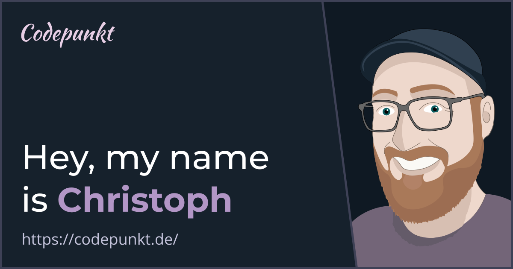

<table><tr><td valign="top" width="50%">

### About me

I work as a Software Architect at [dSPACE](https://www.dspace.com/en/pub/home.cfm) where I support multiple scrum teams with web technologies and cloud architecture. I've been building for the web since 1996 and left a footprint in various industries. I live in Paderborn, Germany, where I organise the local JavaScript meetup.

I'm curious, open-minded and love technology, UI and UX design and video games. I believe in a culture that allows failure, supports experiments and celebrates learnings. I do some quality freelance consulting for web application development, SaaS and cloud architecture and write about web development and cloud technology on my [Blog](https://codepunkt.de/writing) and [Twitter](https://twitter.com/code_punkt).

</td><td valign="top" width="50%">

### Latest blog posts

<!-- blog start -->

*   [Evaluation order of field initializers in JavaScript and TypeScript](https://codepunkt.dewriting/evaluation-order-of-field-initializers-in-javascript-and-typescript/) *This article introduces you to my latest side project and describes a problem that I encountered because I did not understand the sequence between initializing class fields and calling a parent constructor. It then continues to explain how class fields are initialized in javascript and typescript and how I solved my initial problem.*

*   [How to create a self-updating GitHub profile README](https://codepunkt.dewriting/how-to-create-a-self-updating-github-profile-readme/) *Profile READMEs are a new GitHub feature that allows user-defined content to be displayed on top of your GitHub profile page. This article explains how to create a basic README, shows few beautiful examples and explains how I've built mine to automatically update with my latest blog posts.*

*   [Generating beautiful Open Graph images with Node.js](https://codepunkt.dewriting/generating-beautiful-open-graph-images-with-nodejs/) *Open graph images provide nice previews when sharing your website. This article explains how to automatically generate open graph images with Node.js and integrate the results into a Gatsby site.*

<!-- blog end -->

</td></tr></table>

